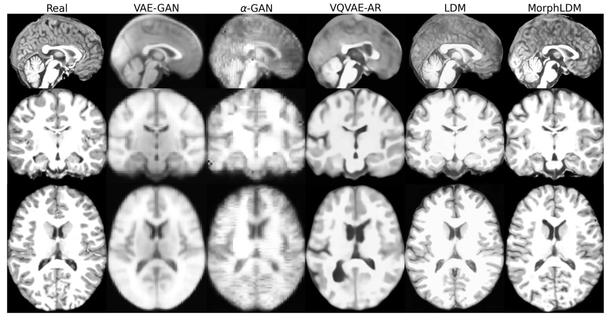
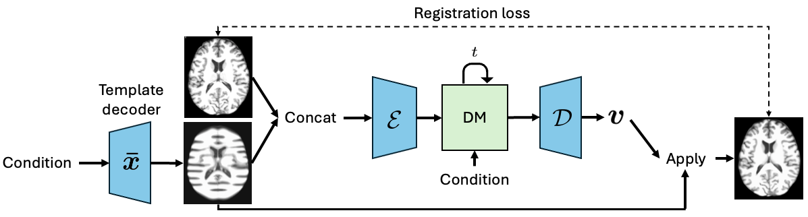
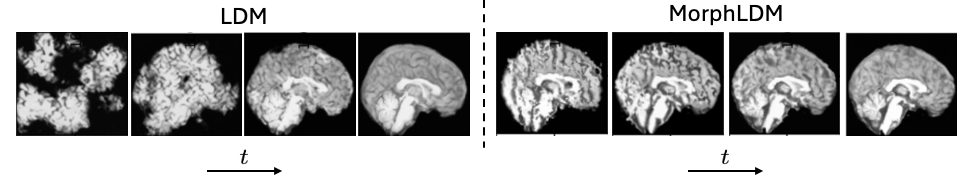

# MorphLDM
MorphLDM is a 3D brain MRI generation method based on state-of-the-art latent diffusion models (LDMs), called MorphLDM, that generates novel images by applying synthesized deformation fields to a learned template.



## Dependencies
Our code builds directly on [MONAI](https://github.com/Project-MONAI/MONAI/tree/dev) and [GenerativeModels](https://github.com/Project-MONAI/GenerativeModels) repositories.
Make sure they are installed and included in your PYTHONPATH.

## Training on your own data
To train on your own data, edit the `get_data()` function in both `train_autoencoder.py` and `train_diffusion.py` to return your `train_loader` and `val_loader`.
The code expects each mini-batch to be in the form of a dictionary with keys `image`, `age`, and `sex`.
You can edit this to include your own conditions

`config.json` contains the hyperparameters for training the models.
`environment_config.json` contains the paths to the data, output directory, and logging information.

### Train Autoencoder
`python train_autoencoder.py -c config.json -e environment_config.json`

### Train Diffusion UNet
`python train_diffusion.py -c config.json -e environment_config.json`

## How it works



MorphLDM differs from LDMs in the design of the encoder/decoder. 
First, a learned template is outputted by a template decoder, optionally conditioned on image-level attributes. 
Then, an encoder takes in both an image and the template and outputs a latent embedding; this latent is passed to a deformation field decoder, whose output deformation field is applied to the template. 
Finally, a registration loss is minimized between the original image and the deformed template with respect to the encoder and both decoders. 
Subsequently, a diffusion model is trained on these learned latent embeddings.

To synthesize an image, MorphLDM generates a novel latent in the same way as standard LDMs. 
The decoder maps this latent to its corresponding deformation field, which is subsequently applied to the learned template.

## Citation
```
@misc{wang2025generatingnovelbrainmorphology,
      title={Generating Novel Brain Morphology by Deforming Learned Templates}, 
      author={Alan Q. Wang and Fangrui Huang and Bailey Trang and Wei Peng and Mohammad Abbasi and Kilian Pohl and Mert Sabuncu and Ehsan Adeli},
      year={2025},
      eprint={2503.03778},
      archivePrefix={arXiv},
      primaryClass={eess.IV},
      url={https://arxiv.org/abs/2503.03778}, 
}
```
